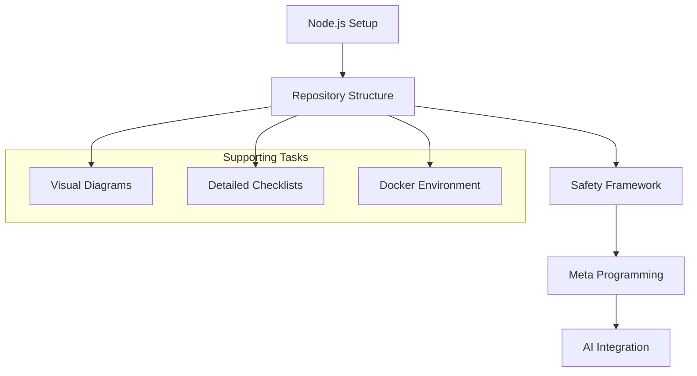
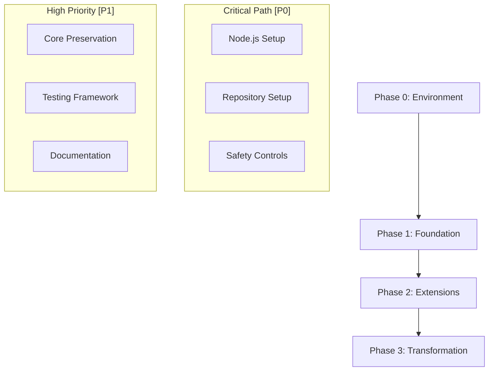

# MetaCline Migration Guide

## Quick Reference

```yaml
current_phase: Phase 0
current_priority: Environment Setup [P0]
blocked_items: []
last_updated: 2025-01-12
```

## RICE Prioritization Matrix

### Scoring System

```yaml
formula: RICE = (Reach * Impact * Confidence) / Effort
scales:
  reach: 1-10 (users affected)
  impact: 0.25-3 (minimal=0.25, low=0.5, medium=1, high=2, massive=3)
  confidence: 0-100% (confidence in estimates)
  effort: 0.5-5 (person-months)
```

### Task Prioritization

#### Critical Infrastructure [P0]

```yaml
node_js_setup:
  reach: 10       # All developers
  impact: 3       # Massive (blocks everything)
  confidence: 90% # Very confident
  effort: 0.5     # 2 weeks
  rice_score: 54  # (10 * 3 * 0.9) / 0.5
  status: NEXT

repository_structure:
  reach: 10
  impact: 3
  confidence: 95%
  effort: 1
  rice_score: 28.5
  dependencies: [node_js_setup]

safety_framework:
  reach: 10
  impact: 3
  confidence: 80%
  effort: 2
  rice_score: 12
  dependencies: [repository_structure]
```

#### Development Tools [P1]

```yaml
visual_diagrams:
  reach: 8
  impact: 1
  confidence: 70%
  effort: 1
  rice_score: 5.6

detailed_checklists:
  reach: 9
  impact: 2
  confidence: 85%
  effort: 1.5
  rice_score: 10.2

docker_environment:
  reach: 7
  impact: 2
  confidence: 75%
  effort: 2
  rice_score: 5.25
```

#### Core Features [P0]

```yaml
meta_programming:
  reach: 10
  impact: 3
  confidence: 85%
  effort: 3
  rice_score: 8.5
  dependencies: [safety_framework]

ai_integration:
  reach: 10
  impact: 3
  confidence: 90%
  effort: 2
  rice_score: 13.5
  dependencies: [meta_programming]
```

### Implementation Order (by RICE score)

1. 🔴 Node.js Setup (54.0)
2. 🔴 Repository Structure (28.5)
3. 🔴 AI Integration (13.5)
4. 🔴 Safety Framework (12.0)
5. 🟡 Detailed Checklists (10.2)
6. 🔴 Meta Programming (8.5)
7. 🟡 Visual Diagrams (5.6)
8. 🟡 Docker Environment (5.25)

### Visual Task Dependencies



## I. Strategic Overview

### Vision

- Transform Roo-Cline into MetaCline
- Enable self-evolving capabilities
- Maintain safety and stability
- Ensure seamless user experience

### Success Criteria

- [ ] All P0 tasks completed
- [ ] Core functionality preserved
- [ ] New capabilities integrated
- [ ] Safety protocols active
- [ ] Documentation complete

### Risk Assessment Matrix

```yaml
critical_risks:
  data_safety:
    impact: High
    mitigation: Safety Framework [P0]
  version_compatibility:
    impact: High
    mitigation: Testing Strategy [P0]
  performance:
    impact: Medium
    mitigation: Monitoring System [P1]
```

## II. Implementation Roadmap

### Phase Dependencies



### Task Priority Levels

- [P0] 🔴 Critical Path (Blocking)
- [P1] 🟡 High Priority (Essential)
- [P2] 🟢 Medium Priority (Important)
- [P3] ⚪ Low Priority (Optional)

## III. Execution Phases

### Phase 0: Environment Setup [CURRENT]

#### Critical Path [P0]

1. Node.js Configuration

   ```yaml
   status: pending
   dependencies: []
   steps:
     - install_nvm
     - set_node_version
     - verify_environment
   ```

2. Repository Structure

   ```yaml
   status: pending
   dependencies: 
     - node_setup
   steps:
     - create_branch
     - organize_files
     - setup_git_hooks
   ```

3. Safety Framework

   ```yaml
   status: pending
   dependencies:
     - repository_setup
   steps:
     - install_safety_tools
     - configure_validators
     - setup_monitoring
   ```

#### Supporting Tasks [P1]

1. Development Tools
2. Docker Environment
3. Initial Testing

### Phase 1: Foundation Preservation

#### Core Functionality [P0]

```yaml
components:
  vscode_extension:
    status: pending
    dependencies: [phase_0]
  chat_modes:
    status: pending
    dependencies: [vscode_extension]
  api_integrations:
    status: pending
    dependencies: [safety_framework]
```

#### Infrastructure [P1]

- Docker Configuration
- Database Setup
- Workflow Automation

### Phase 2: MetaCline Extensions

#### Meta-Programming Engine [P0]

```yaml
components:
  analyzer:
    status: pending
    dependencies: [core_functionality]
  generator:
    status: pending
    dependencies: [analyzer]
  validator:
    status: pending
    dependencies: [safety_framework]
```

#### AI Integration [P1]

```yaml
providers:
  openrouter:
    models: [claude-3-opus, gpt-4-turbo]
    priority: P0
  anthropic:
    models: [claude-3]
    priority: P1
```

### Phase 3: Transformation

#### Safety Protocols [P0]

```yaml
components:
  validation:
    status: pending
    coverage: 95%
  monitoring:
    status: pending
    alerts: enabled
  rollback:
    status: pending
    automation: true
```

## IV. Operational Guidelines

### Daily Workflow

1. Check Priority Tasks
2. Update Status
3. Document Changes
4. Review Safety
5. Update Migration Guide

### Status Tracking

```yaml
status_codes:
  "✓": Completed
  "🚧": In Progress
  "❌": Blocked
  "⏳": Pending
```

### Communication Protocol

```yaml
updates:
  daily: standup
  weekly: review
  monthly: assessment
  
channels:
  technical: github
  team: discord
  emergency: direct
```

## V. Technical Reference

### Core Dependencies

[Previous dependencies section]

### Safety Framework

[Previous safety framework section]

### Performance Standards

[Previous performance standards section]

## VI. Appendices

### A. Detailed Specifications

[Link to detailed technical docs]

### B. Migration Checklists

[Link to operational checklists]

### C. Emergency Procedures

[Link to emergency protocols]

## Progress Tracking

### Current Sprint

```yaml
sprint:
  start: 2025-01-12
  end: 2025-01-26
  focus: Phase 0
  critical_path:
    - Node.js Setup
    - Repository Structure
    - Safety Framework
```

### Completed Items

- [ ] Initial Documentation
- [ ] Project Structure
- [ ] Basic Safety Controls

### Next Actions

1. Complete Node.js setup
2. Initialize repository structure
3. Configure safety framework

### Setup Script Strategy

#### Current Setup Script Analysis

```yaml
script: scripts/setup.sh
status: needs_refactor
issues:
  - Combines multiple RICE priorities
  - Mixes P0 and P2 tasks
  - No granular error handling
  - Limited progress tracking
```

#### Proposed Script Structure

```yaml
scripts:
  setup_core.sh: # P0 (RICE: 54.0)
    purpose: "Core development environment"
    tasks:
      - Node.js verification
      - NVM installation
      - Core dependencies
    status: to_create
    
  setup_docker.sh: # P2 (RICE: 5.25)
    purpose: "Docker environment"
    tasks:
      - Docker verification
      - Container setup
      - Service initialization
    status: to_create
    dependencies: [setup_core.sh]
    
  setup_safety.sh: # P0 (RICE: 12.0)
    purpose: "Safety framework"
    tasks:
      - Security tools
      - Validation setup
      - Monitoring config
    status: to_create
    dependencies: [setup_core.sh]
```

#### Migration Plan for Setup Scripts

1. 🔴 Phase 1: Core Setup (Current Focus)

   ```bash
   # Split current setup.sh into modular scripts
   scripts/
   ├── setup_core.sh     # P0 - Node.js and core setup
   ├── setup_docker.sh   # P2 - Docker environment
   ├── setup_safety.sh   # P0 - Safety framework
   └── setup.sh         # Main orchestrator (preserved for compatibility)
   ```

2. 🟡 Phase 2: Script Improvements
   - Add progress tracking
   - Implement error handling
   - Add rollback capabilities
   - Include validation checks

3. 🟢 Phase 3: Integration
   - Connect with monitoring
   - Add telemetry
   - Implement automated testing
   - Add self-diagnostic features

#### Immediate Actions

1. Create `setup_core.sh` focusing on Node.js setup
2. Update existing `setup.sh` to be a wrapper
3. Move Docker-related commands to `setup_docker.sh`
4. Add proper dependency checks
