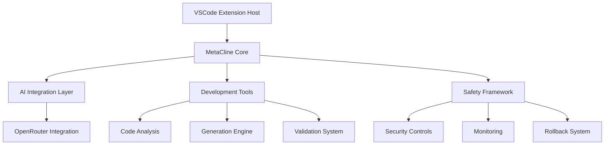
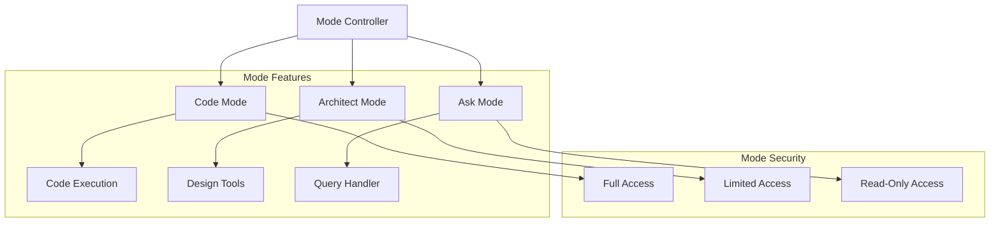
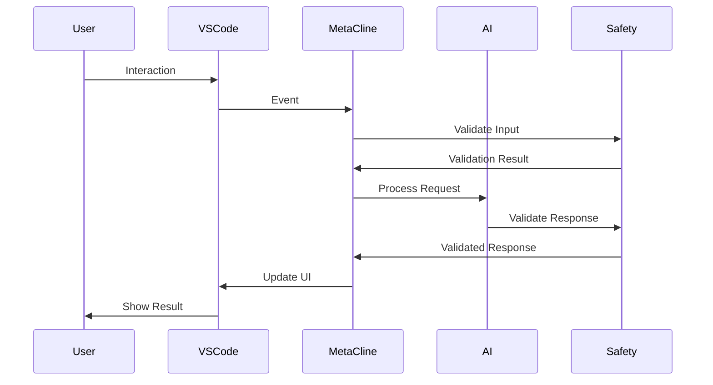

# Technical Architecture

## System Overview

MetaCline is a sophisticated AI-powered development environment built as a VSCode extension, integrating multiple AI models and development tools to provide an enhanced coding experience.

## Core Components

### 1. Extension Architecture



### Mode Management Architecture



### Mode State Management

```typescript
interface ModeStateManager {
  currentMode: string;
  allowedTransitions: Map<string, string[]>;
  modeConfigurations: Map<string, ModeConfig>;
  
  // Mode lifecycle
  initializeMode(mode: string): Promise<void>;
  cleanupMode(mode: string): Promise<void>;
  
  // State persistence
  persistModeState(mode: string): Promise<void>;
  restoreModeState(mode: string): Promise<void>;
}
```

### 2. Key Components

#### 2.1 MetaCline Core

- Extension activation and lifecycle management
- Command registration and handling
- WebView UI management
- State management
- Event system

#### 2.2 AI Integration Layer

- Model management and routing
- Context handling
- Response processing
- Stream handling
- Error management

#### 2.3 Development Tools

- Code analysis engine
- Generation system
- Validation framework
- Testing utilities
- Documentation tools

#### 2.4 Safety Framework

- Input validation
- Output sanitization
- Security controls
- Monitoring system
- Rollback mechanisms

## Technical Stack

### 1. Core Technologies

- Node.js (>=18.0.0)
- TypeScript (^5.0.0)
- VSCode Extension API
- WebView API

### 2. External Services

- OpenRouter API
- Supabase
- N8N

### 3. Development Tools

- ESBuild
- Jest
- ESLint
- Prettier
- Husky

## Data Flow



## Security Architecture

### 1. Security Layers

- Input validation
- Request sanitization
- Response validation
- Code analysis
- Runtime monitoring

### 2. Data Protection

- Secure storage
- Encryption at rest
- Secure communication
- Access control
- Audit logging

## Performance Considerations

### 1. Response Time Targets

- UI interactions: <50ms
- Local operations: <200ms
- AI operations: <2000ms
- Background tasks: Async

### 2. Resource Management

- Memory optimization
- CPU utilization control
- Network request batching
- Cache management
- Background processing

## Scalability Design

### 1. Horizontal Scaling

- Stateless components
- Distributed processing
- Load balancing
- Service isolation

### 2. Vertical Scaling

- Resource optimization
- Performance tuning
- Memory management
- Process isolation

## Integration Points

### 1. VSCode Integration

- Extension API
- WebView API
- Workspace API
- Debug API
- Terminal API

### 2. External Services

- AI model APIs
- Database services
- Workflow automation
- Monitoring services
- Analytics systems

## Development Workflow

### 1. Local Development

- Setup scripts
- Development containers
- Hot reload
- Debug configuration
- Test automation

### 2. CI/CD Pipeline

- Automated testing
- Code quality checks
- Security scanning
- Performance testing
- Deployment automation

## Monitoring and Observability

### 1. Metrics Collection

- Performance metrics
- Error rates
- Usage statistics
- Resource utilization
- Response times

### 2. Logging Strategy

- Structured logging
- Error tracking
- Audit trails
- Performance logging
- Security events

## Future Considerations

### 1. Planned Enhancements

- Advanced AI capabilities
- Enhanced security features
- Performance optimizations
- Additional integrations
- Extended tooling

### 2. Scalability Improvements

- Service mesh integration
- Enhanced caching
- Distributed processing
- Resource optimization
- Performance tuning

## Appendix

### A. Component Dependencies

- Detailed dependency graph
- Version requirements
- Compatibility matrix
- Update strategy
- Migration paths

### B. Configuration Reference

- Environment variables
- Configuration files
- Default settings
- Override mechanisms
- Validation rules

### C. API Documentation

- Internal APIs
- External APIs
- WebView API
- Extension API
- Service APIs
