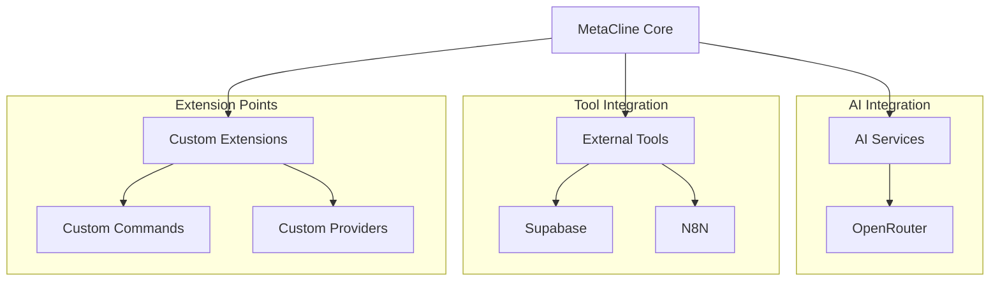
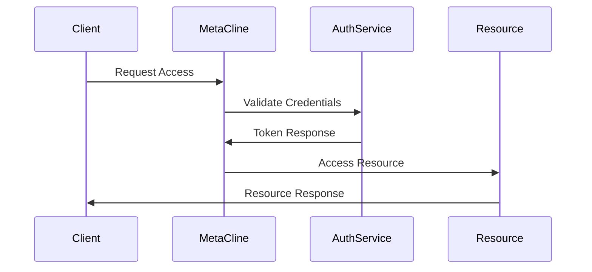

# MetaCline Integration Guide

## Overview

This guide provides comprehensive documentation for integrating with MetaCline, including external services, APIs, and extension points. It covers both using MetaCline's APIs and extending its functionality.

## Integration Architecture

### 1. Integration Points



### 2. Integration Types

```typescript
interface IntegrationType {
  type: 'ai' | 'tool' | 'extension';
  scope: 'core' | 'plugin' | 'workflow';
  access: 'public' | 'private' | 'restricted';
  authentication: AuthMethod[];
}
```

## AI Service Integration

### 1. OpenRouter Integration

```typescript
interface OpenRouterConfig {
  apiKey: string;
  baseUrl: string;
  models: {
    default: string;
    allowed: string[];
  };
  settings: {
    temperature: number;
    maxTokens: number;
    topP: number;
  };
  systemMode: 'code' | 'architect' | 'ask';  // Support for different modes
  safetyControls: {
    inputValidation: boolean;
    outputSanitization: boolean;
    executionMonitoring: boolean;
  };
}

// Example configuration
const openRouterSetup = {
  apiKey: process.env.OPENROUTER_API_KEY,
  baseUrl: 'https://openrouter.ai/api/v1',
  models: {
    default: 'deepseek/deepseek-chat',
    allowed: [
      'anthropic/claude-3.5-sonnet:beta',
      'gemini-2.0-flash-thinking-exp-1219',
      'gemini-exp-1206',
      'gemini-2.0-flash-exp',
      'openai/o1'
    ]
  },
  safetyControls: {
    inputValidation: true,
    outputSanitization: true,
    executionMonitoring: true
  },
};
```

### Mode-Specific Integration

```typescript
interface ModeConfiguration {
mode: 'code' | 'architect' | 'ask';
capabilities: {
codeExecution: boolean;
fileSystemAccess: boolean;
commandExecution: boolean;
};
modelPreferences: {
[mode: string]: string; // Preferred model per mode
};
}


## External Tool Integration

### 1. Supabase Integration

```typescript
interface SupabaseConfig {
  url: string;
  anonKey: string;
  serviceRole: string;
  settings: {
    autoRefresh: boolean;
    persistSession: boolean;
  };
}

// Database schema
interface DatabaseSchema {
  conversations: {
    id: string;
    user_id: string;
    content: string;
    created_at: string;
  };
  settings: {
    user_id: string;
    preferences: JsonObject;
  };
}
```

### 2. N8N Integration

```typescript
interface N8NConfig {
  baseUrl: string;
  apiKey: string;
  webhooks: {
    [key: string]: string;
  };
}

// Workflow definition
interface WorkflowDefinition {
  triggers: Trigger[];
  actions: Action[];
  connections: Connection[];
}
```

## Extension Development

### 1. Custom Command Integration

```typescript
interface CustomCommand {
  id: string;
  title: string;
  handler: (...args: any[]) => Promise<any>;
  when?: string;
  keybinding?: string;
}

// Example command
const exampleCommand: CustomCommand = {
  id: 'metacline.customAction',
  title: 'Custom Action',
  handler: async (context) => {
    // Implementation
  },
  keybinding: 'ctrl+shift+p'
};
```

### 2. Custom Provider Integration

```typescript
interface CustomProvider {
  id: string;
  type: 'ai' | 'tool' | 'service';
  initialize(): Promise<void>;
  dispose(): Promise<void>;
  handlers: {
    [key: string]: (...args: any[]) => Promise<any>;
  };
}
```

## Authentication & Authorization

### 1. Authentication Methods

```typescript
interface AuthenticationConfig {
  // OAuth2 configuration
  oauth2: {
    clientId: string;
    clientSecret: string;
    redirectUri: string;
    scopes: string[];
  };
  
  // API key configuration
  apiKey: {
    header: string;
    prefix: string;
  };
  
  // Session configuration
  session: {
    duration: number;
    refreshThreshold: number;
  };
}
```

### 2. Authorization Flows



## Data Integration

### 1. Data Models

```typescript
interface DataModel {
  // Conversation model
  Conversation: {
    id: string;
    messages: Message[];
    metadata: Metadata;
  };
  
  // Settings model
  Settings: {
    userId: string;
    preferences: Preferences;
    integrations: Integration[];
  };
}
```

### 2. Data Flow

```typescript
interface DataFlow {
  // Input processing
  processInput(data: any): Promise<ProcessedData>;
  
  // Output formatting
  formatOutput(data: any): Promise<FormattedData>;
  
  // Data validation
  validateData(data: any): Promise<ValidationResult>;
}
```

## Webhook Integration

### 1. Webhook Configuration

```typescript
interface WebhookConfig {
  endpoint: string;
  method: 'GET' | 'POST' | 'PUT' | 'DELETE';
  headers: Record<string, string>;
  authentication?: {
    type: 'bearer' | 'basic' | 'apiKey';
    credentials: string;
  };
}
```

### 2. Event Types

```typescript
interface WebhookEvents {
  // Conversation events
  'conversation.created': ConversationEvent;
  'conversation.updated': ConversationEvent;
  
  // Integration events
  'integration.connected': IntegrationEvent;
  'integration.error': IntegrationEvent;
}
```

## Error Handling

### 1. Error Types

```typescript
interface IntegrationError {
  code: string;
  message: string;
  context?: any;
  timestamp: number;
  severity: 'low' | 'medium' | 'high' | 'critical';
}
```

### 2. Error Responses

```typescript
interface ErrorResponse {
  status: number;
  error: {
    type: string;
    message: string;
    details?: any;
  };
  requestId: string;
}
```

## Configuration Management

### 1. Integration Settings

```typescript
const integrationSettings = {
  // AI service settings
  ai: {
    defaultProvider: 'openrouter',
    timeout: 30000,
    retryAttempts: 3
  },
  
  // External tool settings
  tools: {
    supabase: {
      poolSize: 20,
      timeout: 10000
    },
    n8n: {
      webhookTimeout: 5000
    }
  }
};
```

### 2. Environment Variables

```bash
# AI Services
OPENROUTER_API_KEY=your_key_here

# External Services
SUPABASE_URL=your_url_here
SUPABASE_ANON_KEY=your_key_here
N8N_API_KEY=your_key_here

# Security
JWT_SECRET=your_secret_here
ENCRYPTION_KEY=your_key_here
```

## Testing & Validation

### 1. Integration Tests

```typescript
interface IntegrationTest {
  // Test setup
  setup(): Promise<void>;
  
  // Test execution
  execute(): Promise<TestResult>;
  
  // Test cleanup
  cleanup(): Promise<void>;
}
```

### 2. Validation Rules

```typescript
interface ValidationRules {
  // Input validation
  input: {
    maxSize: number;
    allowedTypes: string[];
    validationRules: RegExp[];
  };
  
  // Output validation
  output: {
    format: string;
    schema: JsonSchema;
  };
}
```

## Best Practices

### 1. Integration Guidelines

- Use environment variables for sensitive data
- Implement proper error handling
- Follow rate limiting guidelines
- Cache responses when appropriate
- Implement retry mechanisms
- Log integration activities

### 2. Security Guidelines

- Use secure communication (HTTPS)
- Implement proper authentication
- Validate all inputs
- Sanitize all outputs
- Monitor integration health
- Regular security audits

## Troubleshooting

### 1. Common Issues

| Issue | Possible Cause | Solution |
|-------|---------------|----------|
| Authentication Failed | Invalid credentials | Check API keys |
| Rate Limit Exceeded | Too many requests | Implement backoff |
| Timeout | Slow response | Adjust timeouts |
| Invalid Response | Schema mismatch | Validate schema |

### 2. Debugging Tools

```typescript
interface DebuggingTools {
  // Request tracing
  traceRequest(requestId: string): Promise<RequestTrace>;
  
  // Log analysis
  analyzeLogs(timeRange: TimeRange): Promise<LogAnalysis>;
  
  // Performance monitoring
  monitorPerformance(): Promise<PerformanceMetrics>;
}
```

## Appendix

### A. Integration Checklist

- [ ] Environment setup complete
- [ ] Authentication configured
- [ ] Error handling implemented
- [ ] Tests written and passing
- [ ] Documentation updated
- [ ] Security review completed

### B. API Reference

```yaml
endpoints:
  ai:
    base: /api/v1/ai
    methods:
      - POST /complete
      - POST /analyze
      
  tools:
    base: /api/v1/tools
    methods:
      - POST /execute
      - GET /status
      
  webhooks:
    base: /api/v1/webhooks
    methods:
      - POST /receive
      - PUT /configure
```

### C. Resource Links

```yaml
documentation:
  openrouter: https://openrouter.ai/docs
  supabase: https://supabase.com/docs
  n8n: https://docs.n8n.io

support:
  email: support@metacline.dev
  docs: https://docs.metacline.dev
  github: https://github.com/metacline
```
