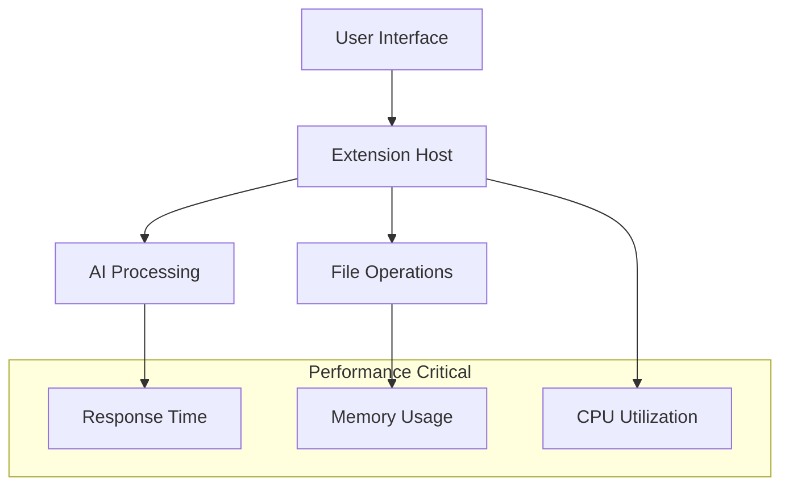

# MetaCline Performance Optimization

## Overview

This document outlines MetaCline's performance optimization strategies, benchmarks, and best practices to ensure optimal performance across all components of the development environment.

## Performance Architecture

### 1. Performance Layers



### 2. Performance Metrics

```typescript
interface PerformanceMetrics {
  responseTime: {
    ui: number;        // milliseconds
    ai: number;        // milliseconds
    fileOps: number;   // milliseconds
  };
  resourceUsage: {
    cpu: number;       // percentage
    memory: number;    // megabytes
    disk: number;      // megabytes/second
  };
  throughput: {
    requests: number;  // requests/second
    operations: number;// operations/second
  };
}
```

## Core Performance Components

### 1. Response Time Optimization

```typescript
interface ResponseTimeOptimizer {
  // UI responsiveness
  measureUiLatency(): number;
  optimizeRenderCycle(): void;
  
  // Operation timing
  trackOperationTime(operation: string): Promise<number>;
  identifyBottlenecks(): PerformanceBottleneck[];
  
  // Optimization strategies
  applyOptimizations(target: string): Promise<OptimizationResult>;
}
```

Target Response Times:

| Operation Type | Target (ms) | Maximum (ms) |
|---------------|-------------|--------------|
| UI Interaction | < 50 | 100 |
| Code Analysis | < 200 | 500 |
| AI Response | < 1000 | 2000 |
| File Operations | < 100 | 300 |

### 2. Resource Management

```typescript
interface ResourceManager {
  // Memory management
  monitorMemoryUsage(): MemoryStats;
  optimizeMemoryAllocation(): void;
  
  // CPU optimization
  trackCpuUsage(): CpuStats;
  balanceWorkload(): void;
  
  // Disk operations
  optimizeDiskAccess(): void;
  cacheFrequentData(): void;
}
```

## Caching Strategy

### 1. Multi-Level Cache

```typescript
interface CacheSystem {
  // Memory cache
  memoryCache: {
    set(key: string, value: any, ttl?: number): void;
    get(key: string): any;
    invalidate(key: string): void;
  };
  
  // Disk cache
  diskCache: {
    store(key: string, value: any): Promise<void>;
    retrieve(key: string): Promise<any>;
    clear(): Promise<void>;
  };
}
```

### 2. Cache Policies

| Cache Type | TTL | Size Limit | Eviction Policy |
|------------|-----|------------|-----------------|
| Memory | 5 min | 100MB | LRU |
| Disk | 1 hour | 1GB | FIFO |
| AI Results | 30 min | 500MB | LRU |
| File Index | 15 min | 200MB | LFU |

## Code Optimization

### 1. Static Analysis

```typescript
interface CodeOptimizer {
  // Performance analysis
  analyzeCodePerformance(code: string): PerformanceReport;
  
  // Optimization suggestions
  suggestOptimizations(): Suggestion[];
  
  // Automatic optimizations
  optimizeCode(code: string): Promise<string>;
}
```

### 2. Runtime Optimization

```typescript
interface RuntimeOptimizer {
  // Process management
  optimizeProcessExecution(): void;
  
  // Thread management
  balanceThreadPool(): void;
  
  // Resource allocation
  optimizeResourceUsage(): void;
}
```

## Load Management

### 1. Load Balancing

```typescript
interface LoadBalancer {
  // Request distribution
  distributeLoad(): void;
  
  // Capacity planning
  adjustCapacity(): void;
  
  // Health checking
  checkSystemHealth(): HealthStatus;
}
```

### 2. Scaling Policies

| Metric | Scale Up | Scale Down |
|--------|----------|------------|
| CPU | > 70% | < 30% |
| Memory | > 80% | < 40% |
| Response Time | > 1s | < 200ms |
| Error Rate | > 5% | < 1% |

## Performance Monitoring

### 1. Real-time Monitoring

```typescript
interface PerformanceMonitor {
  // Metrics collection
  collectMetrics(): Metrics[];
  
  // Performance alerts
  alertOnThreshold(metric: string, threshold: number): void;
  
  // Trend analysis
  analyzeTrends(): TrendReport;
}
```

### 2. Performance Dashboard

```typescript
interface Dashboard {
  // Real-time metrics
  displayMetrics(): void;
  
  // Historical data
  showTrends(): void;
  
  // Alerts
  displayAlerts(): void;
}
```

## Optimization Techniques

### 1. Code-Level Optimizations

```typescript
// Lazy loading
const lazyLoad = async (module: string) => {
  const component = await import(module);
  return component;
};

// Memoization
const memoize = (fn: Function) => {
  const cache = new Map();
  return (...args: any[]) => {
    const key = JSON.stringify(args);
    if (cache.has(key)) return cache.get(key);
    const result = fn(...args);
    cache.set(key, result);
    return result;
  };
};
```

### 2. System-Level Optimizations

```typescript
interface SystemOptimizer {
  // Process optimization
  optimizeProcesses(): void;
  
  // Memory management
  optimizeMemory(): void;
  
  // I/O optimization
  optimizeIO(): void;
}
```

## Performance Testing

### 1. Load Testing

```typescript
interface LoadTester {
  // Stress testing
  runStressTest(config: TestConfig): TestResults;
  
  // Endurance testing
  runEnduranceTest(duration: number): TestResults;
  
  // Spike testing
  runSpikeTest(intensity: number): TestResults;
}
```

### 2. Benchmark Suite

```typescript
interface BenchmarkSuite {
  // Performance benchmarks
  runBenchmarks(): BenchmarkResults;
  
  // Comparison analysis
  compareResults(baseline: Results, current: Results): Comparison;
  
  // Regression testing
  checkRegression(): RegressionReport;
}
```

## Best Practices

### 1. Development Guidelines

- Use async/await for I/O operations
- Implement proper error handling
- Optimize bundle size
- Minimize DOM operations
- Use efficient data structures

### 2. Operation Guidelines

- Regular performance monitoring
- Proactive optimization
- Resource usage tracking
- Regular benchmarking
- Performance budgets

## Configuration

### 1. Performance Settings

```typescript
const performanceConfig = {
  // Cache settings
  cache: {
    memoryLimit: 100 * 1024 * 1024, // 100MB
    diskLimit: 1024 * 1024 * 1024,  // 1GB
    ttl: 300000                      // 5 minutes
  },
  
  // Thread pool
  threading: {
    minThreads: 2,
    maxThreads: 8,
    idleTimeout: 60000               // 1 minute
  },
  
  // Rate limiting
  rateLimit: {
    maxRequests: 100,
    windowMs: 60000                  // 1 minute
  }
};
```

### 2. Optimization Flags

```typescript
const optimizationFlags = {
  enableCaching: true,
  useCompression: true,
  lazyLoading: true,
  prefetching: true,
  backgroundProcessing: true
};
```

## Appendix

### A. Performance Tools

1. Profiling Tools
   - Chrome DevTools
   - Node.js Profiler
   - Memory Heap Snapshot

2. Monitoring Tools
   - Prometheus
   - Grafana
   - Custom Metrics

3. Testing Tools
   - Apache JMeter
   - K6
   - Artillery

### B. Optimization Checklist

- [ ] Bundle size optimization
- [ ] Code splitting implemented
- [ ] Cache strategy defined
- [ ] Performance monitoring setup
- [ ] Load testing completed
- [ ] Resource usage optimized

### C. Performance Budgets

```yaml
budgets:
  bundle_size: 
    js: 500KB
    css: 100KB
  
  response_time:
    api: 200ms
    ui: 100ms
    
  resource_usage:
    cpu: 70%
    memory: 80%
    disk: 70%
```

## Mode-Specific Performance Considerations

```typescript
interface ModePerformance {
  // Mode-specific optimizations
  optimizeForMode(mode: string): Promise<void>;
  
  // Performance targets per mode
  modeTargets: {
    code: {
      responseTime: 1000,  // ms
      maxMemory: 512      // MB
    },
    architect: {
      responseTime: 2000,  // ms
      maxMemory: 256      // MB
    },
    ask: {
      responseTime: 500,   // ms
      maxMemory: 128      // MB
    }
  };
}
```

### Mode Transition Performance

```typescript
interface ModeTransitionOptimizer {
  // Optimize mode switching
  optimizeTransition(fromMode: string, toMode: string): Promise<void>;
  
  // Cache management per mode
  manageModeCache(mode: string): Promise<void>;
  
  // Resource allocation
  allocateResources(mode: string): Promise<void>;
}
```
