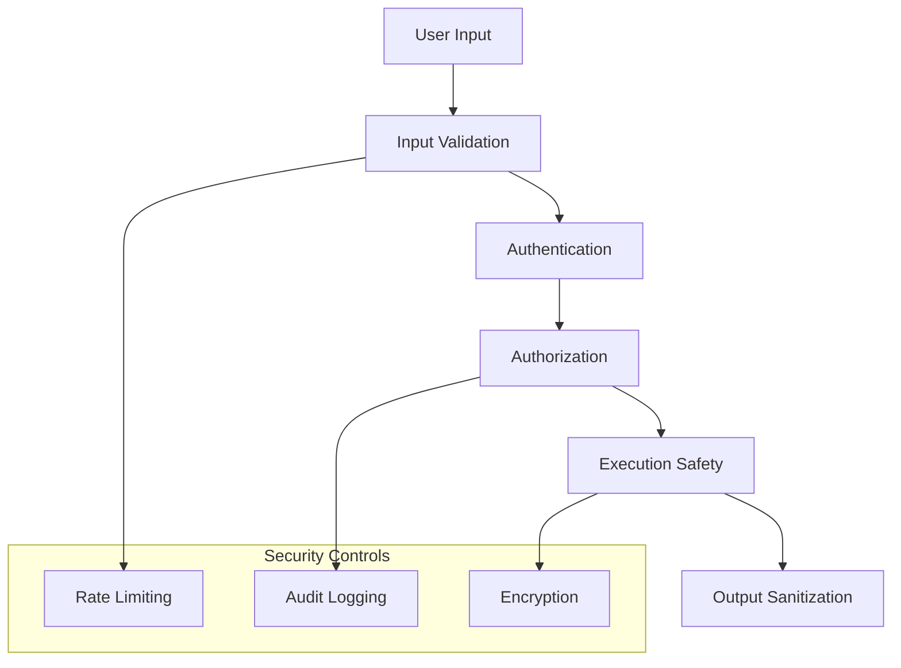
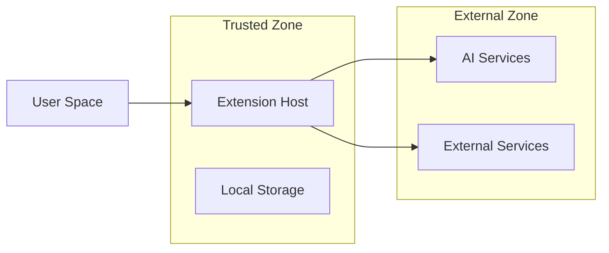
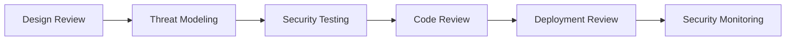

# MetaCline Security Model

## Overview

This document outlines MetaCline's comprehensive security model, designed to ensure the safety, integrity, and privacy of the development environment and its users.

## Security Architecture

### 1. Security Layers



### 2. Trust Boundaries



## Core Security Components

### 1. Authentication System

```typescript
interface AuthenticationSystem {
  // Token-based authentication
  validateToken(token: string): Promise<boolean>;
  refreshToken(token: string): Promise<string>;
  revokeToken(token: string): Promise<void>;
  
  // API key management
  validateApiKey(key: string): Promise<boolean>;
  rotateApiKey(oldKey: string): Promise<string>;
  
  // Session management
  validateSession(sessionId: string): Promise<boolean>;
  terminateSession(sessionId: string): Promise<void>;
}
```

### 2. Authorization Framework

```typescript
interface AuthorizationFramework {
  // Permission checking
  hasPermission(userId: string, resource: string, action: string): Promise<boolean>;
  
  // Role management
  assignRole(userId: string, role: string): Promise<void>;
  removeRole(userId: string, role: string): Promise<void>;
  
  // Resource access
  grantAccess(userId: string, resource: string): Promise<void>;
  revokeAccess(userId: string, resource: string): Promise<void>;
}
```

## Data Protection

### 1. Encryption Standards

- Transport Layer: TLS 1.3
- Data at Rest: AES-256-GCM
- Key Management: PKCS #11

```typescript
interface EncryptionService {
  encrypt(data: string, key: CryptoKey): Promise<string>;
  decrypt(data: string, key: CryptoKey): Promise<string>;
  generateKey(): Promise<CryptoKey>;
  rotateKey(oldKey: CryptoKey): Promise<CryptoKey>;
}
```

### 2. Data Classification

| Level | Description | Examples | Protection Measures |
|-------|-------------|----------|-------------------|
| L1 | Public | Documentation, Public APIs | Basic Encryption |
| L2 | Internal | Configurations, Logs | Strong Encryption |
| L3 | Sensitive | User Data, Credentials | Enhanced Encryption + Access Controls |
| L4 | Critical | Security Keys, Tokens | Maximum Security + Audit Trails |

## Code Security

### 1. Static Analysis

```typescript
interface StaticAnalyzer {
  // Code scanning
  scanCode(code: string): Promise<SecurityVulnerability[]>;
  
  // Dependency checking
  checkDependencies(): Promise<DependencyIssue[]>;
  
  // Configuration validation
  validateConfig(config: object): Promise<ConfigurationRisk[]>;
}
```

### 2. Runtime Protection

```typescript
interface RuntimeProtection {
  // Execution sandboxing
  createSandbox(): Promise<Sandbox>;
  
  // Resource limiting
  setResourceLimits(limits: ResourceLimits): void;
  
  // Process isolation
  isolateProcess(processId: string): Promise<void>;
}
```

## Access Control

### 1. Role-Based Access Control (RBAC)

```typescript
interface RBACSystem {
  roles: {
    ADMIN: Role;
    DEVELOPER: Role;
    USER: Role;
  };
  
  permissions: {
    READ: Permission;
    WRITE: Permission;
    EXECUTE: Permission;
  };
}
```

### 2. Permission Matrix

| Role      | Read | Write | Execute | Admin |
|-----------|------|-------|---------|-------|
| Admin     | ✓    | ✓     | ✓       | ✓     |
| Developer | ✓    | ✓     | ✓       | ✗     |
| User      | ✓    | ✗     | ✓       | ✗     |

## Audit and Compliance

### 1. Audit Logging

```typescript
interface AuditSystem {
  // Event logging
  logEvent(event: SecurityEvent): Promise<void>;
  
  // Audit trail
  getAuditTrail(filters: AuditFilter): Promise<AuditEntry[]>;
  
  // Compliance reporting
  generateComplianceReport(): Promise<ComplianceReport>;
}
```

### 2. Compliance Requirements

- GDPR Compliance
- SOC 2 Type II
- ISO 27001
- OWASP Top 10

## Incident Response

### 1. Security Incident Handling

```typescript
interface IncidentResponse {
  // Incident detection
  detectIncident(event: SecurityEvent): Promise<Incident>;
  
  // Response actions
  respondToIncident(incident: Incident): Promise<void>;
  
  // Recovery procedures
  recoverFromIncident(incident: Incident): Promise<void>;
}
```

### 2. Response Protocol

1. Detection
2. Analysis
3. Containment
4. Eradication
5. Recovery
6. Lessons Learned

## Security Monitoring

### 1. Real-time Monitoring

```typescript
interface SecurityMonitoring {
  // Metrics collection
  collectMetrics(): Promise<SecurityMetrics>;
  
  // Alert generation
  generateAlert(event: SecurityEvent): Promise<void>;
  
  // Threat detection
  detectThreats(): Promise<Threat[]>;
}
```

### 2. Alert Thresholds

| Metric | Warning | Critical | Action |
|--------|---------|----------|--------|
| Failed Logins | >5/min | >10/min | Block IP |
| API Requests | >100/min | >200/min | Rate Limit |
| Error Rate | >5% | >10% | Investigation |
| CPU Usage | >70% | >90% | Scale Up |

## Secure Development Lifecycle

### 1. Security Gates



### 2. Security Checklist

- [ ] Threat modeling completed
- [ ] Security requirements defined
- [ ] Static analysis performed
- [ ] Dependency scanning done
- [ ] Penetration testing completed
- [ ] Security review approved

## Configuration Management

### 1. Secure Defaults

```typescript
const securityDefaults = {
  sessionTimeout: 30 * 60 * 1000, // 30 minutes
  maxLoginAttempts: 5,
  passwordMinLength: 12,
  mfaRequired: true,
  tlsVersion: 'TLS 1.3',
  httpSecureOnly: true
};
```

### 2. Security Headers

```typescript
const securityHeaders = {
  'Strict-Transport-Security': 'max-age=31536000; includeSubDomains',
  'Content-Security-Policy': "default-src 'self'",
  'X-Frame-Options': 'DENY',
  'X-Content-Type-Options': 'nosniff',
  'Referrer-Policy': 'strict-origin-when-cross-origin'
};
```

## Appendix

### A. Security Tools

1. Static Analysis Tools
   - CodeQL
   - SonarQube
   - ESLint Security Plugin

2. Dynamic Analysis Tools
   - OWASP ZAP
   - Burp Suite
   - Dynamic API Testing

3. Dependency Scanning
   - Dependabot
   - Snyk
   - OWASP Dependency Check

### B. Security Procedures

1. Key Rotation Schedule
   - API Keys: 90 days
   - Encryption Keys: 180 days
   - Access Tokens: 24 hours
   - Session Tokens: 30 minutes

2. Backup Procedures
   - Daily incremental backups
   - Weekly full backups
   - Monthly archive backups
   - Quarterly backup testing

### C. Emergency Contacts

```yaml
security_team:
  email: security@metacline.dev
  emergency: +1-XXX-XXX-XXXX
  slack: #security-alerts

incident_response:
  primary: ir@metacline.dev
  emergency: +1-XXX-XXX-XXXX
  oncall: https://oncall.metacline.dev
```

## Mode-Specific Security Controls

```typescript
interface ModeSecurity {
  code: {
    allowExecution: true,
    requireApproval: false,
    loggingLevel: 'detailed'
  },
  architect: {
    allowExecution: false,
    requireApproval: true,
    loggingLevel: 'standard'
  },
  ask: {
    allowExecution: false,
    requireApproval: false,
    loggingLevel: 'basic'
  }
}

interface SecurityValidation {
  validateModeTransition(from: string, to: string): Promise<boolean>;
  enforceModeSecurity(mode: string, action: string): Promise<void>;
  logModeOperation(mode: string, operation: string): Promise<void>;
}
